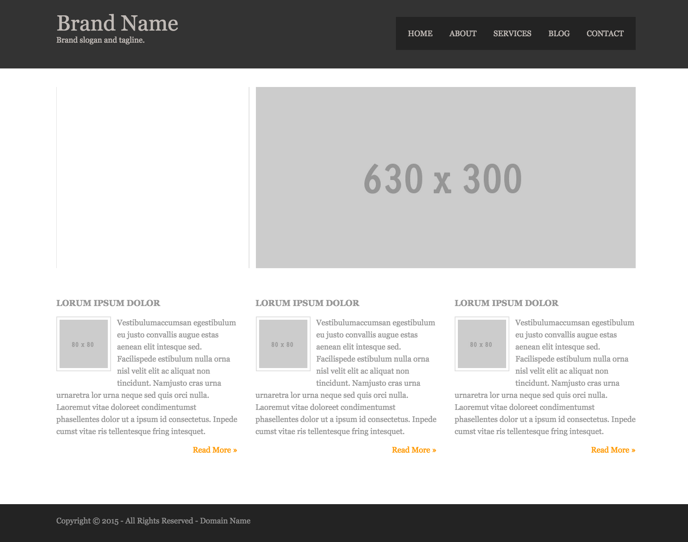

# Simple Site Project

For this project, you will be creating a landing page for a company/business of your choice (including a made up one...).

Create a new GitHub repository for this project.

Create the landing page from the screenshot below, with the following
constraints:

* The site must use a `reset` or `normalize` stylesheet.
* The `box-sizing` should be set to `border-box` for all elements.
* The layout should be done with floats and flexbox.
* The markup should use `semantic` and `valid` HTML5.
* The code should use proper indentation.
* Use git through the CLI and have appropriate commit messages.
* The site must conform to the layout and metrics given in the mockup, but colors, fonts, content are changeable.

